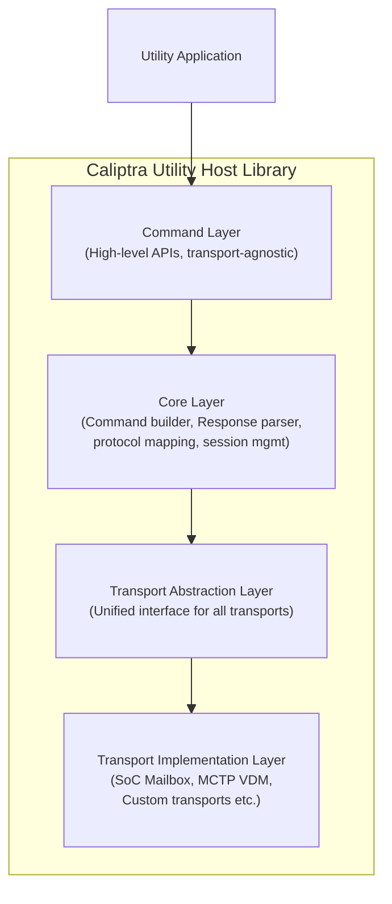
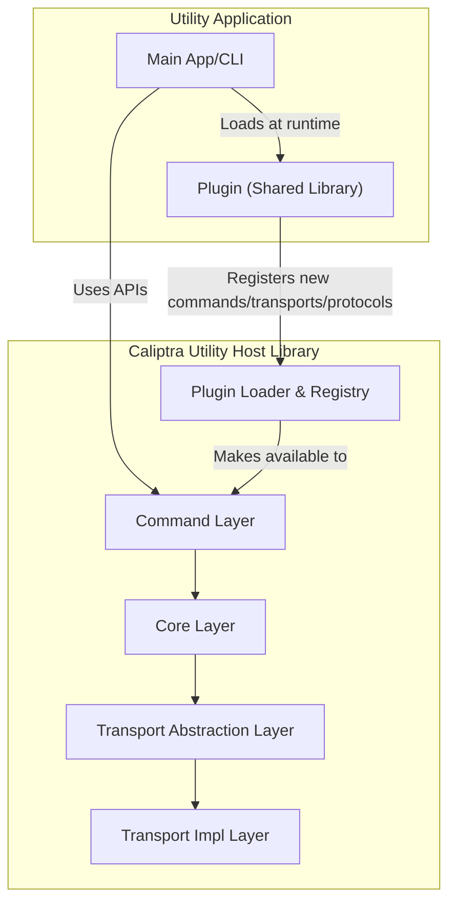
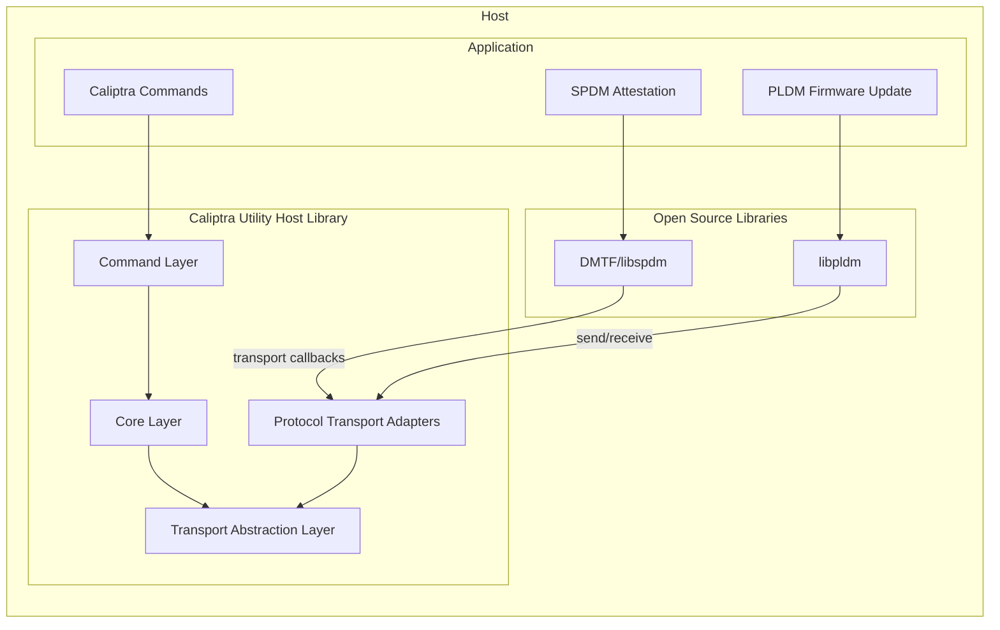

# Caliptra Utility Host Library Design

## Overview

The Caliptra Utility host library is a modular, extensible, and transport-agnostic Rust library designed to enable the development of utility tools that can run on both BMC and host systems. These utilities facilitate both in-band and out-of-band communication with the Caliptra subsystem on the device, supporting a variety of transport interfaces such as MCU mailbox and MCTP VDM. The library provides a unified API for all supported Caliptra commands, along with C bindings for integration with C/C++ applications, making it easy to build robust management, provisioning, and diagnostic tools for diverse deployment environments.

### Design Goals

- **Modularity**: Clear separation between transport layer, command processing, and application logic
- **Extensibility**: Easy addition of new commands and transport mechanisms
- **Transport Agnostic**: Support multiple communication channels without changing application code
- **Type Safety**: Strong typing for command structures and responses
- **Thread Safety**: Safe for use in multi-threaded environments

### Use Cases

- **Device Identification and Capabilities**
    - Retrieve firmware versions, unique device identifiers, and device capabilities to ensure compatibility and proper configuration.
    - Query device-specific information such as chip identifiers or subsystem details.
- **Debugging and Diagnostics**
    - Retrieve debug logs to analyze device behavior, diagnose issues, and monitor runtime states.
    - Clear logs to reset diagnostic data and maintain storage efficiency.
- **Certificate Management**
    - Export Certificate Signing Requests (CSRs) for device keys to facilitate secure provisioning.
    - Import signed certificates to establish a trusted certificate chain for device authentication.
- **Debug Unlock Mechanisms**
    - Facilitate secure debugging in production environments
    - Ensure controlled access to debugging features
- **Cryptographic Services**
    - AES encryption and decryption
    - SHA hashing
    - Random number generation
    - Digital signing
    - Signature verification
    - Key exchange

## Architecture

### Layered framework



### Component Descriptions

#### Command Layer
- **Purpose**: Provides high-level, transport-agnostic APIs for Caliptra commands
- **Functionality**:
  - Exposes simple function calls for each Caliptra command (e.g., `caliptra_get_device_id()`)
  - Manages stateful operations like multi-part SHA/AES computations
  - Maintains command contexts across multiple related operations
  - Handles command-specific validation and parameter checking
  - Abstracts complex command sequences into simple APIs
- **Data Flow**: Receives API calls → Validates parameters → Passes to Core Layer for execution

#### Core Layer
- **Purpose**: Handles the mechanics of command execution and protocol management
- **Functionality**:
  - Builds properly formatted command packets with headers and checksums
  - Parses and validates responses from the device
  - Implements retry logic for transient failures
  - Manages command sequencing and state machines
  - Handles protocol-level error recovery
- **Data Flow**: Receives command requests → Formats packets → Uses Transport Layer → Parses responses

#### Transport Abstraction Layer
- **Purpose**: Provides a unified interface to different physical transport mechanisms
- **Functionality**:
  - Defines standard operations (open, close, send, receive)
  - Manages connection lifecycle and readiness checks
  - Handles transport-level timeouts and flow control
  - Provides both synchronous and asynchronous operation modes
  - Maps transport-specific errors to common error codes
- **Data Flow**: Receives formatted packets → Routes to appropriate transport → Returns raw responses

#### Transport Implementation Layer
- **Purpose**: Implements actual communication with hardware interfaces
- **Functionality**:
  - **SoC Mailbox**: Direct memory-mapped I/O operations to mailbox registers
  - **MCTP VDM**: Socket-based communication over MCTP protocol
  - **Future transports**:
  - Handles hardware-specific initialization and configuration
  - Manages low-level data transfer and synchronization
- **Data Flow**: Receives bytes to send → Writes to hardware → Reads response bytes

## Interface Design

The library is organized into several Rust crates, each providing specific functionality:

| Crate | Description |
|-------|-------------|
| `caliptra-util-host-transport` | Transport trait and implementations (Mailbox, etc.) |
| `caliptra-util-host-session` | Session management and command execution |
| `caliptra-util-host-command-types` | Command/response type definitions with zerocopy support |
| `caliptra-util-host-commands` | High-level command API functions |
| `caliptra-util-host-osal` | OS abstraction layer for portability |
| `caliptra-util-host-cbinding` | C bindings for the library |

### Transport Layer

The transport layer provides an abstraction for device communication through the `Transport` trait:

```rust
/// Transport trait for device communication
pub trait Transport: Send + Sync {
    /// Connect to the device
    fn connect(&mut self) -> TransportResult<()>;

    /// Disconnect from the device
    fn disconnect(&mut self) -> TransportResult<()>;

    /// Send a command with the given command ID and payload
    fn send(&mut self, command_id: u32, data: &[u8]) -> TransportResult<()>;

    /// Receive response data into the provided buffer
    fn receive(&mut self, buffer: &mut [u8]) -> TransportResult<usize>;

    /// Check if the transport is connected
    fn is_connected(&self) -> bool;
}

/// Transport error types
pub enum TransportError {
    ConnectionFailed(Option<&'static str>),
    SendFailed(Option<&'static str>),
    ReceiveFailed(Option<&'static str>),
    Timeout,
    NotSupported(&'static str),
    InvalidMessage,
    Disconnected,
    ConfigurationError(&'static str),
    IoError(&'static str),
    BufferError(&'static str),
    // ... additional error variants
}

/// Transport configuration
pub struct TransportConfig {
    pub max_message_size: usize,
    pub timeout_ms: u32,
}
```

#### Mailbox Transport Implementation

The `Mailbox` transport provides communication through a mailbox driver:

```rust
/// Trait for hardware mailbox communication
pub trait MailboxDriver: Send + Sync {
    /// Send a command and return response data
    fn send_command(&mut self, external_cmd: u32, payload: &[u8]) -> Result<&[u8], MailboxError>;

    /// Check if mailbox is ready
    fn is_ready(&self) -> bool;

    /// Connect to mailbox
    fn connect(&mut self) -> Result<(), MailboxError>;

    /// Disconnect from mailbox
    fn disconnect(&mut self) -> Result<(), MailboxError>;
}

/// Mailbox error types
pub enum MailboxError {
    NotReady,
    Timeout,
    InvalidCommand,
    CommunicationError,
    BufferOverflow,
    DeviceError(u32),
}

/// Mailbox Transport using dynamic dispatch
pub struct Mailbox<'a> { mailbox: &'a mut dyn MailboxDriver,

    // internal state...
}

impl<'a> Mailbox<'a> {
    /// Create a new mailbox transport with the given driver
    pub fn new(mailbox: &'a mut dyn MailboxDriver) -> Self;
}

impl Transport for Mailbox<'_> {
    // Transport trait implementation...
}
```

### Session Layer

The session layer manages device connections and command execution:

```rust
/// Session state enumeration
#[repr(u32)]
pub enum SessionState {
    Disconnected = 0,
    Connecting = 1,
    Connected = 2,
    Authenticated = 3,
    Error = 4,
}

/// Session configuration
pub struct SessionConfig {
    pub connection_timeout_ms: u32,
    pub command_timeout_ms: u32,
    pub max_retries: u8,
    pub keepalive_interval_ms: u32,
    pub auto_reconnect: bool,
}

/// Session statistics
pub struct SessionStatistics {
    pub commands_sent: u64,
    pub commands_succeeded: u64,
    pub commands_failed: u64,
    pub bytes_sent: u64,
    pub bytes_received: u64,
    pub reconnect_count: u32,
    pub last_error_count: u32,
}

/// Session error enumeration
pub enum SessionError {
    SessionNotFound(u32),
    InvalidState { current: SessionState, expected: SessionState },
    TransportError(&'static str),
    OsalError(&'static str),
    ConfigurationError(&'static str),
    AuthenticationError(&'static str),
    ResourceError(&'static str),
    SerializationError(&'static str),
    MaxRetriesExceeded,
    InternalError(&'static str),
    Custom(&'static str),
}

/// Device session context using dynamic dispatch
pub struct CaliptraSession<'t> {
    pub session_id: u32,
    pub state: SessionState,
    pub config: SessionConfig,
    pub stats: SessionStatistics,
    // internal fields...
}

impl<'t> CaliptraSession<'t> {
    /// Create a new session with the given transport
    pub fn new(session_id: u32, transport: &'t mut dyn Transport) -> SessionResult<Self>;

    /// Create session with custom configuration
    pub fn with_config(
        session_id: u32,
        transport: &'t mut dyn Transport,
        config: SessionConfig,
    ) -> SessionResult<Self>;

    /// Connect to the device
    pub fn connect(&mut self) -> SessionResult<()>;

    /// Disconnect from device
    pub fn disconnect(&mut self) -> SessionResult<()>;

    /// Check if session is connected and ready
    pub fn is_ready(&self) -> bool;

    /// Execute a structured command through the session
    pub fn execute_command<Req, Resp>(&mut self, command: &Req) -> SessionResult<Resp>
    where
        Req: CommandRequest,
        Resp: CommandResponse;

    /// Execute a command with explicit command ID
    pub fn execute_command_with_id<Req>(
        &mut self,
        command_id: CaliptraCommandId,
        request: &Req,
    ) -> SessionResult<Req::Response>
    where
        Req: CommandRequest + IntoBytes,
        Req::Response: FromBytes + Immutable;

    /// Get session info
    pub fn get_info(&self) -> SessionInfo;

    /// Handle session errors and recovery
    pub fn handle_error(&mut self, error: SessionError) -> SessionResult<()>;
}
```

### Command Types Layer

Command and response structures are defined using zerocopy for efficient serialization:

```rust
/// Caliptra command IDs
#[repr(u32)]
pub enum CaliptraCommandId {
    // Device Info Commands (0x0001-0x000F)
    GetFirmwareVersion = 0x0001,
    GetDeviceCapabilities = 0x0002,
    GetDeviceId = 0x0003,
    GetDeviceInfo = 0x0004,

    // Certificate Commands (0x1001-0x101F)
    GetIdevidCert = 0x1001,
    GetLdevidCert = 0x1002,
    GetFmcAliasCert = 0x1003,
    GetRtAliasCert = 0x1004,
    GetCertChain = 0x1010,
    StoreCertificate = 0x1011,

    // Hash Commands (0x2001-0x201F)
    HashInit = 0x2001,
    HashUpdate = 0x2002,
    HashFinalize = 0x2003,
    HashOneShot = 0x2004,

    // Symmetric Crypto Commands (0x3001-0x302F)
    AesInit = 0x3001,
    AesUpdate = 0x3002,
    AesFinalize = 0x3003,

    // Asymmetric Crypto Commands (0x4001-0x402F)
    EcdsaSign = 0x4001,
    EcdsaVerify = 0x4002,
    EcdhDerive = 0x4003,

    // Debug Commands (0x7001-0x701F)
    DebugEcho = 0x7001,
    DebugGetStatus = 0x7002,
    DebugGetLog = 0x7005,

    // Fuse Commands (0x8001-0x801F)
    FuseRead = 0x8001,
    FuseWrite = 0x8002,
    FuseLock = 0x8003,
}

/// Command processing errors
pub enum CommandError {
    InvalidCommand,
    InvalidRequest,
    InvalidResponse,
    InvalidResponseLength,
    ResponseTooLong,
    SerializationError,
    DeserializationError,
    ChecksumMismatch,
    Unsupported,
    BufferTooSmall,
    Custom(&'static str),
}
```

#### Example Command Types

```rust
/// Get device ID request
#[repr(C)]
#[derive(Debug, Clone, IntoBytes, FromBytes, Immutable)]
pub struct GetDeviceIdRequest {
    // Empty request - no parameters needed
}

/// Get device ID response
#[repr(C)]
#[derive(Debug, Clone, IntoBytes, FromBytes, Immutable)]
pub struct GetDeviceIdResponse {
    pub vendor_id: u16,
    pub device_id: u16,
    pub subsystem_vendor_id: u16,
    pub subsystem_id: u16,
}

impl CommandRequest for GetDeviceIdRequest {
    type Response = GetDeviceIdResponse;
    const COMMAND_ID: CaliptraCommandId = CaliptraCommandId::GetDeviceId;
}

/// Get firmware version request
#[repr(C)]
#[derive(Debug, Clone, IntoBytes, FromBytes, Immutable)]
pub struct GetFirmwareVersionRequest {
    pub index: u32, // 0 = ROM, 1 = Runtime
}

/// Firmware version response
#[repr(C)]
#[derive(Debug, Clone, IntoBytes, FromBytes, Immutable)]
pub struct GetFirmwareVersionResponse {
    pub common: CommonResponse,
    pub version: [u32; 4],   // Major, minor, patch, build
    ...
}
```

### Command API Layer

The command API provides high-level functions for interacting with Caliptra devices:

```rust
/// High-level result type for API functions
pub type CaliptraResult<T> = Result<T, CaliptraApiError>;

/// API-specific error types
pub enum CaliptraApiError {
    Osal(OsalError),
    InvalidParameter(&'static str),
    SessionNotInitialized,
    TransportNotAvailable,
    CommandFailed(&'static str),
    SessionError(&'static str),
}

// ============================================================================
// Device Information Commands
// ============================================================================

/// Get device identification information
pub fn caliptra_cmd_get_device_id(
    session: &mut CaliptraSession,
) -> CaliptraResult<GetDeviceIdResponse>;

/// Get device information
pub fn caliptra_cmd_get_device_info(
    session: &mut CaliptraSession,
    info_type: u32,
) -> CaliptraResult<GetDeviceInfoResponse>;

/// Get device capabilities
pub fn caliptra_cmd_get_device_capabilities(
    session: &mut CaliptraSession,
) -> CaliptraResult<GetDeviceCapabilitiesResponse>;

/// Get firmware version
pub fn caliptra_cmd_get_firmware_version(
    session: &mut CaliptraSession,
    index: u32,  // 0 = ROM, 1 = Runtime
) -> CaliptraResult<GetFirmwareVersionResponse>;
```

### C Bindings

The library provides C bindings through the `cbinding` crate for integration with C/C++ applications:

```c
// Error code type for C API
typedef enum {
    CALIPTRA_SUCCESS = 0,
    CALIPTRA_ERROR_UNKNOWN = 1,
    CALIPTRA_ERROR_INVALID_ARGUMENT = 2,
    CALIPTRA_ERROR_TIMEOUT = 3,
    CALIPTRA_ERROR_NOT_SUPPORTED = 4,
    CALIPTRA_ERROR_TRANSPORT = 5,
    CALIPTRA_ERROR_PROTOCOL = 6,
    CALIPTRA_ERROR_DEVICE = 7,
    CALIPTRA_ERROR_MEMORY = 8,
    CALIPTRA_ERROR_BUSY = 9,
    CALIPTRA_ERROR_STATE = 10,
    CALIPTRA_ERROR_IO = 11,
} CaliptraError;

// Protocol types
typedef enum {
    CALIPTRA_PROTOCOL_MAILBOX = 0,
    CALIPTRA_PROTOCOL_MCTP_VDM = 1,
    CALIPTRA_PROTOCOL_CUSTOM = 2,
} CaliptraProtocolType;

// Opaque transport handle
typedef struct CaliptraTransport CaliptraTransport;

// Session management
CaliptraError caliptra_session_create_with_protocol(
    CaliptraTransport* transport,
    CaliptraProtocolType protocol_type,
    CaliptraSession** session
);

CaliptraError caliptra_session_connect(CaliptraSession* session);
CaliptraError caliptra_session_disconnect(CaliptraSession* session);
CaliptraError caliptra_session_destroy(CaliptraSession* session);

// Transport management
CaliptraError caliptra_transport_destroy(CaliptraTransport* transport);

// Device ID structure (C-compatible)
typedef struct {
    uint16_t vendor_id;
    uint16_t device_id;
    uint16_t subsystem_vendor_id;
    uint16_t subsystem_id;
} CaliptraDeviceId;

// Command APIs
CaliptraError caliptra_cmd_get_device_id(
    CaliptraSession* session,
    CaliptraDeviceId* device_id
);
```

### Usage Example (Rust)

```rust
use caliptra_util_host_transport::{Mailbox, MailboxDriver};
use caliptra_util_host_session::CaliptraSession;
use caliptra_util_host_commands::api::caliptra_cmd_get_device_id;

// Implement MailboxDriver for your hardware
struct MyMailboxDriver { /* ... */ }

impl MailboxDriver for MyMailboxDriver {
    fn send_command(&mut self, cmd: u32, payload: &[u8]) -> Result<&[u8], MailboxError> {
        // Hardware-specific implementation
    }
    fn is_ready(&self) -> bool { true }
    fn connect(&mut self) -> Result<(), MailboxError> { Ok(()) }
    fn disconnect(&mut self) -> Result<(), MailboxError> { Ok(()) }
}

fn main() -> Result<(), Box<dyn std::error::Error>> {
    // Create mailbox driver
    let mut driver = MyMailboxDriver::new();

    // Create transport
    let mut transport = Mailbox::new(&mut driver);

    // Create session
    let mut session = CaliptraSession::new(1, &mut transport)?;

    // Connect
    session.connect()?;

    // Get device ID
    let device_id = caliptra_cmd_get_device_id(&mut session)?;
    println!("Vendor ID: 0x{:04x}", device_id.vendor_id);
    println!("Device ID: 0x{:04x}", device_id.device_id);

    // Disconnect
    session.disconnect()?;

    Ok(())
}
```

## Extensibility with Plugin Architecture

The Caliptra Utility host library is designed to be highly extensible, supporting the dynamic addition of new commands, protocols, and transport mechanisms at runtime through a **plugin architecture**. This approach enables third-party developers and system integrators to extend the library’s capabilities without modifying or recompiling the core library.



- **Plugins** are shared libraries (e.g., `.so` or `.dll` files) that implement new commands, protocol handlers, or transport mechanisms.
- The core library provides APIs to **dynamically load, register, and discover** these plugins at runtime.
- This design preserves the existing layered architecture, while enabling runtime extensibility and modularity.

### How Plugins Work

1. **Plugin Interface**

   Each plugin implements a standard interface and exports a descriptor structure.

   ```rust
   /// Plugin descriptor containing metadata and registration function
   pub struct PluginDescriptor {
       /// Plugin name identifier
       pub name: &'static str,
       /// Plugin version string
       pub version: &'static str,
       /// Registration function called by the core library
       pub register: fn() -> CaliptraResult<()>,
       /// Optional cleanup function called on unload
       pub unregister: Option<fn() -> CaliptraResult<()>>,
   }

   /// Macro to export a plugin descriptor from a shared library
   #[macro_export]
   macro_rules! export_plugin {
       ($descriptor:expr) => {
           #[no_mangle]
           pub static CALIPTRA_PLUGIN_DESCRIPTOR: PluginDescriptor = $descriptor;
       };
   }
   ```

   The plugin's `register` function is called by the core library to register new commands, transports, or protocol handlers.

2. **Dynamic Loading**

   The core library provides APIs to load and unload plugins at runtime.

   ```rust
   /// Plugin manager for loading and managing plugins
   pub struct PluginManager {
       // Internal state...
   }

   impl PluginManager {
       /// Create a new plugin manager
       pub fn new() -> Self;

       /// Load a plugin from the specified path
       pub fn load(&mut self, path: &Path) -> CaliptraResult<PluginHandle>;

       /// Unload a plugin by name
       pub fn unload(&mut self, name: &str) -> CaliptraResult<()>;

       /// Get a list of loaded plugins
       pub fn loaded_plugins(&self) -> &[PluginInfo];
   }

   /// Handle to a loaded plugin
   pub struct PluginHandle {
       pub name: String,
       pub version: String,
   }

   /// Information about a loaded plugin
   pub struct PluginInfo {
       pub name: String,
       pub version: String,
       pub path: PathBuf,
   }
   ```

   These use platform mechanisms (`dlopen`/`dlsym` on Linux, `LoadLibrary` on Windows) to load plugins at runtime.

3. **Dynamic Registration**

   Plugins use registration and unregistration APIs to add or remove features.

   ```rust
   /// Command descriptor for plugin-provided commands
   pub struct CommandDescriptor {
       /// Command name
       pub name: &'static str,
       /// Command ID
       pub command_id: u32,
       /// Command execution function
       pub execute: fn(&mut CaliptraSession, &[u8]) -> CaliptraResult<Vec<u8>>,
       /// Human-readable description
       pub description: &'static str,
   }

   /// Transport factory for plugin-provided transports
   pub trait TransportFactory: Send + Sync {
       /// Transport type name
       fn name(&self) -> &str;

       /// Create a new transport instance
       fn create(&self, config: &TransportConfig) -> CaliptraResult<Box<dyn Transport>>;

       /// Human-readable description
       fn description(&self) -> &str;
   }

   /// Protocol handler for plugin-provided protocol implementations
   pub trait ProtocolHandler: Send + Sync {
       /// Protocol type this handler supports
       fn protocol_type(&self) -> ProtocolType;

       /// Process an incoming message
       fn handle_message(&mut self, message: &[u8]) -> CaliptraResult<Vec<u8>>;
   }

   // Registration functions
   /// Register a new command
   pub fn register_command(desc: CommandDescriptor) -> CaliptraResult<()>;

   /// Unregister a command by name
   pub fn unregister_command(name: &str) -> CaliptraResult<()>;

   /// Register a new transport factory
   pub fn register_transport(factory: Box<dyn TransportFactory>) -> CaliptraResult<()>;

   /// Unregister a transport by name
   pub fn unregister_transport(name: &str) -> CaliptraResult<()>;

   /// Register a protocol handler
   pub fn register_protocol_handler(handler: Box<dyn ProtocolHandler>) -> CaliptraResult<()>;

   /// Unregister a protocol handler
   pub fn unregister_protocol_handler(protocol_type: ProtocolType) -> CaliptraResult<()>;
   ```

   The library maintains internal registries of available commands, transports, and protocol handlers. When a plugin is unloaded, it should call the appropriate unregister functions to cleanly remove its features and release resources.

4. **Discovery and Usage**

   Applications can enumerate available commands and transports at runtime.

   ```rust
   /// Get a list of registered commands
   pub fn list_commands() -> Vec<&'static CommandDescriptor>;

   /// Get a list of registered transport factories
   pub fn list_transports() -> Vec<&'static str>;

   /// Get a command descriptor by name
   pub fn get_command(name: &str) -> Option<&'static CommandDescriptor>;

   /// Create a transport instance by name
   pub fn create_transport(name: &str, config: &TransportConfig) -> CaliptraResult<Box<dyn Transport>>;
   ```

   This enables dynamic feature discovery and flexible application logic.

## Extensibility for SPDM and PLDM Support

The Caliptra Utility host library architecture is designed to accommodate future extensions for industry-standard security and firmware management protocols. Specifically, the library can be extended to support **SPDM (Security Protocol and Data Model)** for device attestation and **PLDM (Platform Level Data Model)** for firmware updates by leveraging DMTF open source libraries.

### Design Approach: Transport Adapter Pattern

Rather than implementing SPDM and PLDM protocols directly, the library adopts a transport adapter pattern that aligns with how DMTF libraries are designed:

- **libspdm** expects the application to provide transport send/receive callbacks
- **libpldm** is primarily a message encoding/decoding library that needs a transport mechanism

The host library's core value is providing transport abstraction. By providing transport adapters, the library enables applications to use libspdm and libpldm directly while leveraging the library's transport infrastructure.

### Integration Architecture



### OpenBMC Integration

For out-of-band management scenarios, the host library is eligible to integrate with OpenBMC:

- **libpldm**: OpenBMC already includes libpldm as a core component, enabling seamless integration for PLDM firmware update workflows
- **DMTF/libspdm**: Can be integrated into OpenBMC for SPDM attestation services
- **D-Bus Services**: The library's C bindings enable integration with OpenBMC D-Bus services for system management
- **MCTP Transport**: Leverages OpenBMC's MCTP infrastructure for device communication

### Future Work

> **Note**: The SPDM and PLDM transport adapter implementations are not provided in the current release. The architecture described above outlines the extensibility path for future integration. Third-party developers and system integrators can implement these adapters using the documented transport interfaces and DMTF open source libraries.
