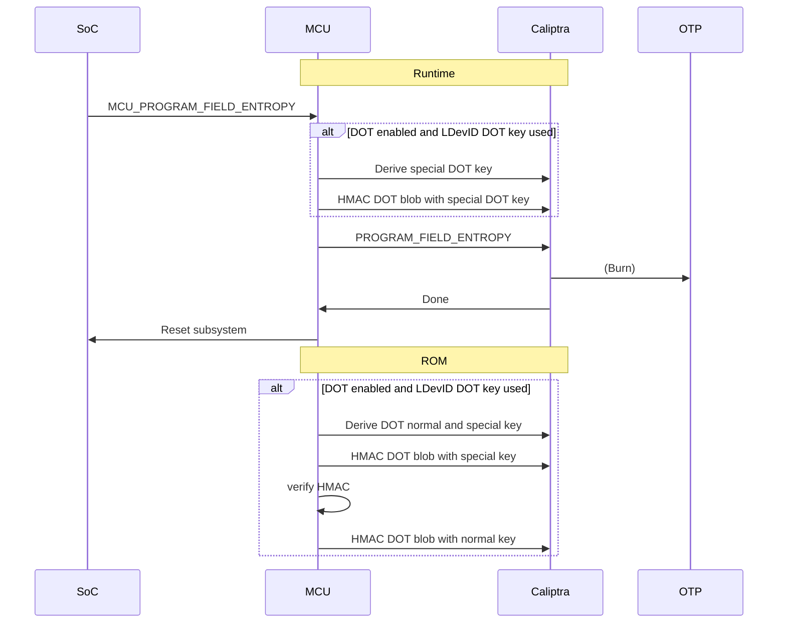

# In-Field Fuse Programming (IFP) Specification

MCU has the [OpenTitan fuse controller](https://opentitan.org/book/hw/ip/otp_ctrl/) (OTP) and [Lifecycle controller](https://opentitan.org/book/hw/ip/lc_ctrl/) (LC), which sit on top of a process-specific fuse macro and manages them with a uniform interface.

The hardware has provisioned the OTP controller with an overall structure that has Caliptra- and general Subsystem-specific blocks, which are required, and vendor-defined blocks.

As part of the Fuse API, we support defining the vendor-specific fuses and assist in provisioning the Caliptra- and vendor-specific fuses.

In general, the Fuse API gives the SoC an easy way to read and write fuses with bit granularity via MCTP or mailbox commands.

## Fuse Defining

We provide a new fuse definition `hjson` file format to assist in further defining fuses.

There are two places where we expand on the standard [OTP memory map](https://github.com/chipsalliance/caliptra-ss/blob/main/src/fuse_ctrl/doc/otp_ctrl_mmap.md):

1. Defining how many bits are backed by actual fuses in each field
2. Defining vendor-specific fields

For an example of (1), the `CPTRA_SS_OWNER_ECC_REVOCATION` is specified as 1 byte (8 bits) in the memory map, but the may only have 4 bits backed by actual fuses in hardware. Our additional fuse map contains a section to define how many bits are available in each field as this information is vendor-specific and hence not present in the standard memory map.

For (2), there are two defined partitions, `VENDOR_SECRET_PROD_PARTITION` (520 bits) and `VENDOR_NON_SECRET_PROD_PARTITION` (984 bits) in the standard memory map. In addition, the vendor can choose to provide additional fuses. We provide a way to split these up into specific areas and automatically generate Rust code to manage them.

### Fuse definition file

Here is an example fuse definition file, for example, `vendor_fuses.hjson`:

```js
{
  // vendor-specific secret fuses
  secret_vendor: [
    {"example_key1": 48}, // size in bytes
    {"example_key2": 48}, // size in bytes
    {"example_key3": 48}, // size in bytes
    {"example_key4": 48}, // size in bytes
  ],
  // vendor-specific non-secret-fuses
  non_secret_vendor: [
    {"example_key_revocation": 1}
  ],
  // TBD how we allow additional fuses outside of these areas, if this is allowed by OTP
  other_fuses: {},
  // entries to define how many bits are in each field, and potentially other information
  fields: [
    // set specifics on Subsystem fuses
    // By default, all bits in each field are assumed to be backed by actual fuse bits.
    // Names should be globally unique
    {name: "CPTRA_SS_OWNER_ECC_REVOCATION", bits: 4}, // size in bits
    // set specifics on vendor-specific fuses
    {name: "example_key_revocation", bits: 4},
  ]
}
```

By default, all bits in each field are assumed to be backed by actual fuse bits unless they have an entry in the `fields` array.

## Fuse definition script

We will provide a script, `cargo xtask fuse-autogen`, that can be used to process an `.hjson` file into:

* Firmware definitions and code for the fuses and bits (Rust)
* Documentation on the fuses and bits (Markdown)

The command will use either a `--platform` flag to indicate the file is `platforms/{platform}/fuse_bits.hjson` or a `--file` to specify the file manually.

This script can optionally generate extra commands for programming specific fuses as well as Rust and C code to access them.

## Fuse Provisioning Commands

The fuse provisioning commands can be used over our [generic command](#mc_fuse_read) interface through MCTP, mailboxes, etc., or through commands in firmware manifest (except read operations).

The commands are:

* Write
* Read
* Lock partition

### Authorization

Only authorized SoC users shall call these commands. This can be authorized through the mechanism itself (i.e., a mailbox that only a trusted SoC component has access to) or cryptographically.

Some example cryptographic mechanisms that could be used:

* A certificate provided to MCU during boot, which will be used to validate signatures on each message.
* An HMAC key imported into Caliptra's cryptographic mailbox during boot, which MCU can use to validate a request. (The key could itself be stored as fuses.)

It will be integrator-defined how which authorization mechanism is required, but we will provide reference implementations with stubs for source-based and HMAC-based authorization.

These commands reference partition, fuse, and bit numbers that must use the same numbers generated from the [Fuse definition script](#fuse-definition-script).

### Limitations

* Reading is not allowed for secret partitions. The secret partitions can only be read via integrator-specific hardware (or by Caliptra for its secret partitions).
* Writing and locking are idempotent.
* Once a partition is locked, it cannot be written to again.
* u32s are represented in little-endian byte order
* Bytes are expected to be implemented in fuses in standard (big-endian) bit order, i.e., 76543210.
* If a byte is only partially filled with bits, then the high-order bits will be 0.
* Partitions, fields, and bits are specified in the particular platform's `otp_mmap.hjson` and `vendor_fuses.hjson` files.

{{#include fuse_api_cmd.md}}

### Field Entropy Provisioning

Field entropy fuses can only be burned by Caliptra runtime, so the flow for provisioning them is different and any changes in them will **invalidate any OCP Device Ownership Transfer blob** stored on the device. See the [MCU OCP DOT implementation spec](dot.md).

This will be an MCU mailbox API command (or other signal to MCU runtime) to trigger that MCU should use the Caliptra mailbox PROGRAM_FIELD_ENTROPY command. If a mailbox command is used, it must be authorized in the same way as other fuse programming API commands (see [authorization](#Authorization))

If OCP DOT is being used, then the MCU ROM must also update the DOT blob after Caliptra core burns field entropy. **Failure to do so may "brick" a device or require a DOT recovery flow, as the ownership information could be corrupted after provisioning field entropy if the DOT root key is derived from the LDevID CDI.**

The flow will be:
1. MCU runtime receives a MCU_PROGRAM_FIELD_ENTROPY command through a mailbox or other signal.
2. If DOT is enabled and the DOT root key is derived from LDevID, we need to store the DOT blob (and re-sign it after FE is updated):
	1. MCU runtime stores the current DOT blob in non-volatile storage, e.g., SRAM that won't be cleared on reset
	2. MCU runtime verifies this DOT blob using the current DOT root key.
	3. MCU runtime indicates that the DOT blob must be checked and re-derived by setting a register or other signal in non-volatile storage, for example, a generic output wire or SRAM.
	4. Sign the DOT blob copy with a new special DOT root key **derived from IDevID**.
3. MCU runtime sends to Caliptra's runtime mailbox the PROGRAM_FIELD_ENTROPY command.
4. MCU runtime waits for a successful response.
5. MCU runtime initiates a reset.
6. If DOT is enabled and the DOT root key is derived from LDevID
	1. MCU ROM checks if we are in a FE programming mode (i.e., from register, input wires, or SRAM contents)
	2. MCU derives both special DOT root key (from IDevID) and the normal DOT root key (from LDevID)
	3. MCU ROM verifies the DOT blob copy in non-volatile storage against the special **IDevID** DOT root key.
	4. MCU ROM copies the DOT blob copy into the standard DOT blob location
	5. MCU ROM asks Caliptra core signs the DOT blob with the current DOT root key.
	6. Continue with the normal boot flow



## Fuse Layout Options

The firmware uses a `FuseLayout` enum to define how fuse values are stored and interpreted. This provides flexibility for different encoding schemes including redundancy and error tolerance. The layout policy can be customized per platform via `McuFuseLayoutPolicy`.

Note that u32s (dwords) are always packed in little-endian byte order and big-endian bit order.

### Layout Types

#### Single

Values are stored literally without any encoding.

Values stored this way in fuses should be protected with ECC.

**Example:** A 4-bit value `0b1101` is stored as `0b1101`

#### OneHot

The logical value is the count of bits set to 1 in the fuse field. This is commonly used for version numbers and counters where incrementing requires only burning one additional fuse.

The values can span multiple u32 words but the result is always a single u32 count value.

**Example:**
- `0b0000` → 0
- `0b0111` → 3

Caution: This method of storing fuses is dangerous, since generally ECC cannot be used if the value can be incremented after the initial value is written.

#### LinearMajorityVote

Each logical bit is duplicated multiple times within a single u32 (or across adjacent u32s). The final value uses majority voting for each bit position to provide error tolerance.

Duplication is limited to < 32x and should be odd.

**Example:** With 2-bit logical value and 3x duplication:
- Raw fuses: `0b100_110_111` (bit 0 has votes `111`, bit 1 has votes `110`, bit 2 has votes `100`)
- Result: `0b011`

Generally this method is used for values that do not have ECC protection but are only written once, usually that only are a few bits in size or less.

#### OneHotLinearMajorityVote

Combines `LinearMajorityVote` with `OneHot` encoding. First applies majority voting to each duplicated bit, then counts the number of bits set.

This is the recommended way to

**Example:** With 3 logical bits and 3x duplication:
- Raw fuses: `0b100_110_111` (bit 0 has votes `111`, bit 1 has votes `110`, bit 2 has votes `100`)
- After majority vote on each bit: `0b011` (2 bits set)
- Result: 2

Generally this method is used for counters and version numbers that can be updated in production and therefore do not have ECC protection.

#### WordMajorityVote

Entire u32 words are duplicated. Each bit position across the duplicated words is decided by majority vote.

**Example:** With 3 duplicated words:
- Raw fuses: `[0b100, 0b110, 0b111]`
- Bit 0: votes are `0,0,1` → majority is `0`
- Bit 1: votes are `0,1,1` → majority is `1`
- Bit 2: votes are `1,1,1` → majority is `1`
- Result: `[0b110]`

This is an alternative to LinearMajorityVote for larger values.

### Common Limitations

- Maximum result size for single value extraction is 32 bits
- For multi-word extraction, the result array size must match the expected output
- All layouts return `McuError::ROM_FUSE_LAYOUT_TOO_LARGE` if constraints are violated
- Unsupported or invalid configurations return `McuError::ROM_UNSUPPORTED_FUSE_LAYOUT`
- Majority vote calculations use ceiling division (e.g., need ≥2 votes for 3 duplicates)

### Default Platform Configuration

The default `McuFuseLayoutPolicy` uses:
- `Single`: For certificate data, identifiers, and validity flags that are assumed to be protected by ECC
- `OneHotLinearMajorityVote` (3x): For SVN fields and counters
- `LinearMajorityVote` (3x): for single revocation fields
- `WordMajorityVote` (3x): for revocation bitmasks

This provides a balance between redundancy for critical security fields and storage efficiency for larger data structures.