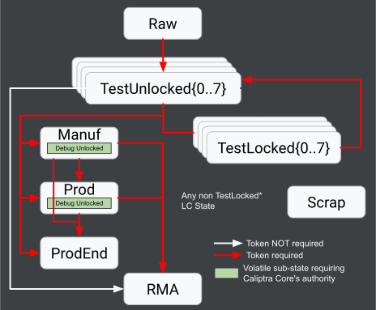
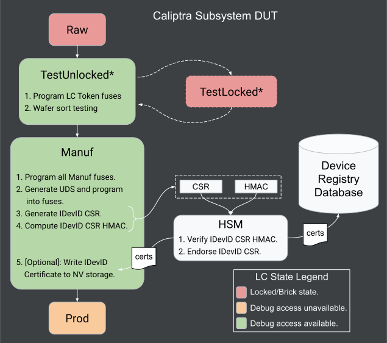

# Caliptra Subsystem Provisioning Guide

## Goal / Disclaimer

This document aims to provide Caliptra Subsystem (SS) silicon vendors/manufacturers with guidance on how to provision devices during manufacturing. Nothing in this document is a requirement for Caliptra Trademark compliance. Note, this document focuses on the technical and operational aspects of provisioning a device with Caliptra Subsystem. Details on how to secure provisioning infrastructure to meet various certification requirements are outside the scope of this document.

## Assets

There are two categories of assets that must be provisioned into a product that integrates Caliptra Subsystem before the device becomes fully operational:

1. fuses
2. IDevID (UDS) certificate

### Fuses

Caliptra SS contains a One-Time Programmable (OTP) fuse memory bank that must be provisioned during SoC manufacturing. The fuse bank contains several logical fields organized across a set of partitions. Additionally, Caliptra SS contains a fuse-backed lifecycle FSM (known as the _lifecycle controller_), whose states gate debug capabilities of a device, thus requiring specific fuse fields be programmed in specific life-cycle states. The table [below](#lifecycle-state-constraints-for-provisioning-fuses) describes the fuse map and the lifecycle states they should be provisioned by.

### Certificates

When requested, the IDevID CSR is generated by the Caliptra Core ROM after receiving the UDS Seed from the Caliptra Subsystem fuse controller. It should be endorsed by an external CA protected via an HSM on an isolated manufacturing network[^1].

There are two different IDevID certificates to be generated, based on the cryptographic keys they are constructed for:

1. ECC secp384r1
2. ML-DSA-87

The signature sizes for each are shown in the following table.
These signatures should be stored in the larger SoC’s nonvolatile storage or other accessible service.

| Certificate type | Signature size (Bytes) |
| :--------------- | :--------------------- |
| ECC Secp384r1    | 96                     |
| ML-DSA-87        | 4627                   |

To be able to reconstruct the IDevID certificate on boot, Caliptra also requires the original [_certificate attributes_](https://chipsalliance.github.io/Caliptra/2.0/specification/HEAD/#idevid-certificate) be stored in the SoC's fuses. The size and encoding of this data is fixed for both certificate types (ECC and ML-DSA), and detailed in the [Caliptra specification](https://chipsalliance.github.io/Caliptra/2.0/specification/HEAD/#idevid-certificate).

[^1]: Network isolation requirements are often dictated by certification requirements, while are outside the scope of this document.

## Provisioning Sequence

The Caliptra Subsystem provisioning sequence is described below. The provisioning sequence is designed to suit various requirements among downstream integrators, including:

1. providing an ATE-friendly provisioning sequence where DUT operations can be performed:
   a. directly over JTAG, and/or
   b. by loading custom MCU firmware into SRAM (via JTAG).
2. The ability to program different fuse partitions at various lifecycle stages.

In addition to the provisioning flow description, the Caliptra project aims to provide a general reference provisioning flow, and supporting tooling / firmware, upstream. These are currently under development, and tied to a caliptra-mcu-sw GitHub [milestone](https://github.com/chipsalliance/caliptra-mcu-sw/milestone/10).

Before describing the sequence, we provide some background information on two important hardware blocks that facilitate the provisioning sequence, namely:

1. lifecycle controller, and
2. fuse controller.

### Background: Lifecycle Controller Architecture

Caliptra Subsystem provides a hardware backed lifecycle FSM (known as the [_lifecycle controller_](https://github.com/chipsalliance/caliptra-ss/blob/main/docs/CaliptraSSHardwareSpecification.md#caliptra-subsystem-life-cycle-controller)) that transitions through several lifecycle states shown in the diagram below:

States only move forward and persist across chip resets; once advanced, it cannot revert to a previous state as lifecycle states are encoded in fuses. Transitions between some states require the use of password-like tokens. All tokens are provisioned in fuses, except the "Raw Unlock Token", which is a netlist constant. The purpose of each lifecycle state is described below. Additionally below is a table that summarizes which states allow debug (i.e. JTAG and DFT) access to various Caliptra Subsystem and SoC components.

| Lifecycle State     | JTAG Access             | DFT Access |
| :------------------ | :---------------------- | :--------- |
| Raw                 | LCC                     | None       |
| TestUnlocked\[0–7\] | LCC, CLTAP\*, MCU, Core | SS, SoC    |
| TestLocked\[0–7\]   | LCC                     | None       |
| Manuf               | LCC, CLTAP\*            | None       |
| Manuf Debug Unlock  | LCC, CLTAP\*, MCU, Core | SoC\*      |
| Prod                | LCC                     | None       |
| Prod Debug Unlock   | LCC, CLTAP\*, MCU, Core | SoC\*      |
| ProdEnd             | LCC                     | None       |
| RMA                 | LCC, CLTAP\*, MCU, Core | SS, SoC    |
| Scrap               | LCC                     | None       |

\* Integration Configurable  
CLTAP \= Chip Level TAP

**TestUnlocked\[0–7\]** states are used for initial testing to ensure chip health. All lifecycle tokens in the `SECRET_LC_TRANSITION_PARTITION` fuse partition should be provisioned in **TestUnlocked0** to allow further actuation of the lifecycle controller during manufacturing. After testing, the chip is locked by entering a **TestLocked\[0–7\]** state to close debug access.

Using a provisioned token, a chip can transition from any of the **TestUnlock\[0–7\] / TestLocked\[0–7\]** states to the **Manuf**(acturing) state. In this state, debug access is once again opened, and the UDS and other manufacturing-specific fuses are injected. All production debug unlock tokens for the production state must be provisioned in this state, and the partition locked.

After manufacturing, the chip enters a production state (Prod or ProdEnd). Additional fuse provisioning (e.g., field entropy, revocation bits) may occur here, but only for fuse partitions not already locked in manufacturing. Entry into debug mode in production uses signature authentication with public keys, supporting multiple debug levels (up to 8), each with different privileges.

Production End & RMA marks the end of the chip’s functional lifecycle. The chip is no longer considered part of the active fleet and is not used for regular operations. Additionally, from any lifecycle state, the chip may transition (unconditionally without token) to the Scrap state, where fuse zeroization is performed, in accordance with FIPS requirements, to securely erase all secret assets stored in fuses.

### Background: Fuse Controller

As mentioned above, Caliptra Subsystem contains a One-Time Programmable (OTP) fuse memory bank that is controlled by a hardware block known as the fuse_ctrl (or [fuse controller](https://github.com/chipsalliance/caliptra-ss/blob/main/docs/CaliptraSSHardwareSpecification.md#caliptra-subsystem-fuse-controller)). The OTP memory bank is split into partitions, and each partition:

1. contains a digest field over the partition, and
2. can be write-locked by writing to the digest field.

The locking mechanism prevents further changes to certain partitions (e.g., UDS). Once locked, these fuses cannot be overwritten for the lifetime of the device, with the exception of zeroizable partitions which may be cleared once a device is decommissioned. While the fuse memory map may be expanded for a particular integration, see the [integration guide](https://github.com/chipsalliance/caliptra-ss/blob/main/docs/CaliptraSSIntegrationSpecification.md#fuse-macro-memory-map-and-fuse-controller-csr-address-map) for more details, a baseline memory map is provided [upstream](https://github.com/chipsalliance/caliptra-ss/blob/main/src/fuse_ctrl/doc/otp_ctrl_mmap.md).

### Provisioning Sequence

Below is a summary of the provisioning flow required to bring a Caliptra Subsystem device from a **raw** lifecycle state to a **production** lifecycle state. This flow assumes all devices in a raw state have all fuses in their, unprogrammed, initial state, i.e., all bits set to zeros. Additionally, while this flow may be performed at a manufacturing stage of the integrator's choosing, we describe the following operations from the perspective of a tester, as if the operations were performed entirely at a Final Test (FT) silicon manufacturing stage with the aid of an Automated Test Equipment (ATE).

1. Tester drives a lifecycle transition via JTAG: Raw → TestUnlocked0
2. Perform wafer sort testing.
3. Tester programs the following fuses (via JTAG or by loading MCU firmware loaded to SRAM):
   1. vendor test
   2. Lifecycle tokens
   3. Manuf debug unlock token
4. Perform more wafer sort testing.
5. Tester drives a lifecycle transition via JTAG: TestUnlocked\* → Manuf
6. Tester programs remaining fuses:
   1. Secure Boot Key hashes / types
   2. UDS fuses via programming sequence with Caliptra Core API
7. Tester requests Caliptra Core to generate HMAC endorsed IDevID CSR and extract from DUT.
8. Tester forward CSR and HMAC to HSM for authentication and endorsement.
9. HSM validates HMAC and endorses IDevID TBS certificate.
10. \[Optional\] Tester program IDevID certificate into integration-specific non-volatile storage.
11. Tester drives a lifecycle transition via JTAG: Manuf → Prod\[End\]

## Appendix

### Lifecycle State Constraints for Provisioning Fuses

The fuse partition below corresponds to the Caliptra Subsystem 2.1.1 [reference fuse map](https://github.com/chipsalliance/caliptra-ss/blob/css-v2.1.1/src/fuse_ctrl/doc/otp_ctrl_mmap.md).

|           **Partition**           |                  **Item**                   | **Size [B]** | **Lifecycle State** |
| :-------------------------------: | :-----------------------------------------: | :----------: | ------------------- |
|     SW_TEST_UNLOCK_PARTITION      |      CPTRA_SS_MANUF_DEBUG_UNLOCK_TOKEN      |      64      | TEST_UNLOCKED       |
|      SECRET_MANUF_PARTITION       |             CPTRA_CORE_UDS_SEED             |      64      | MANUF               |
|      SECRET_PROD_PARTITION_0      |         CPTRA_CORE_FIELD_ENTROPY_0          |      8       | In-Field            |
|      SECRET_PROD_PARTITION_1      |         CPTRA_CORE_FIELD_ENTROPY_1          |      8       | In-Field            |
|      SECRET_PROD_PARTITION_2      |         CPTRA_CORE_FIELD_ENTROPY_2          |      8       | In-Field            |
|      SECRET_PROD_PARTITION_3      |         CPTRA_CORE_FIELD_ENTROPY_3          |      8       | In-Field            |
|        SW_MANUF_PARTITION         |      CPTRA_CORE_ANTI_ROLLBACK_DISABLE       |      4       | MANUF               |
|                                   |     CPTRA_CORE_IDEVID_CERT_IDEVID_ATTR      |      96      | MANUF               |
|                                   |       SOC_SPECIFIC_IDEVID_CERTIFICATE       |      4       | MANUF               |
|                                   |   CPTRA_CORE_IDEVID_MANUF_HSM_IDENTIFIER    |      16      | MANUF               |
|                                   |         CPTRA_CORE_SOC_STEPPING_ID          |      4       | MANUF               |
|                                   |      CPTRA_SS_PROD_DEBUG_UNLOCK_PKS_0       |      48      | MANUF               |
|                                   |      CPTRA_SS_PROD_DEBUG_UNLOCK_PKS_1       |      48      | MANUF               |
|                                   |      CPTRA_SS_PROD_DEBUG_UNLOCK_PKS_2       |      48      | MANUF               |
|                                   |      CPTRA_SS_PROD_DEBUG_UNLOCK_PKS_3       |      48      | MANUF               |
|                                   |      CPTRA_SS_PROD_DEBUG_UNLOCK_PKS_4       |      48      | MANUF               |
|                                   |      CPTRA_SS_PROD_DEBUG_UNLOCK_PKS_5       |      48      | MANUF               |
|                                   |      CPTRA_SS_PROD_DEBUG_UNLOCK_PKS_6       |      48      | MANUF               |
|                                   |      CPTRA_SS_PROD_DEBUG_UNLOCK_PKS_7       |      48      | MANUF               |
|  SECRET_LC_TRANSITION_PARTITION   |        CPTRA_SS_TEST_UNLOCK_TOKEN_1         |      16      | TEST_UNLOCKED       |
|                                   |        CPTRA_SS_TEST_UNLOCK_TOKEN_2         |      16      | TEST_UNLOCKED       |
|                                   |        CPTRA_SS_TEST_UNLOCK_TOKEN_3         |      16      | TEST_UNLOCKED       |
|                                   |        CPTRA_SS_TEST_UNLOCK_TOKEN_4         |      16      | TEST_UNLOCKED       |
|                                   |        CPTRA_SS_TEST_UNLOCK_TOKEN_5         |      16      | TEST_UNLOCKED       |
|                                   |        CPTRA_SS_TEST_UNLOCK_TOKEN_6         |      16      | TEST_UNLOCKED       |
|                                   |        CPTRA_SS_TEST_UNLOCK_TOKEN_7         |      16      | TEST_UNLOCKED       |
|                                   |      CPTRA_SS_TEST_EXIT_TO_MANUF_TOKEN      |      16      | TEST_UNLOCKED       |
|                                   |        CPTRA_SS_MANUF_TO_PROD_TOKEN         |      16      | TEST_UNLOCKED       |
|                                   |       CPTRA_SS_PROD_TO_PROD_END_TOKEN       |      16      | TEST_UNLOCKED       |
|                                   |             CPTRA_SS_RMA_TOKEN              |      16      | TEST_UNLOCKED       |
|           SVN_PARTITION           |       CPTRA_CORE_FMC_KEY_MANIFEST_SVN       |      4       | In-Field            |
|                                   |           CPTRA_CORE_RUNTIME_SVN            |      16      | In-Field            |
|                                   |         CPTRA_CORE_SOC_MANIFEST_SVN         |      16      | In-Field            |
|                                   |       CPTRA_CORE_SOC_MANIFEST_MAX_SVN       |      4       | In-Field            |
|       VENDOR_TEST_PARTITION       |                 VENDOR_TEST                 |      32      | TEST_UNLOCKED       |
|   VENDOR_HASHES_MANUF_PARTITION   |         CPTRA_CORE_VENDOR_PK_HASH_0         |      48      | MANUF               |
|                                   |          CPTRA_CORE_PQC_KEY_TYPE_0          |      4       | MANUF               |
|   VENDOR_HASHES_PROD_PARTITION    |           CPTRA_SS_OWNER_PK_HASH            |      48      | MANUF               |
|                                   |         CPTRA_SS_OWNER_PQC_KEY_TYPE         |      4       | MANUF               |
|                                   |        CPTRA_SS_OWNER_PK_HASH_VALID         |      4       | MANUF               |
|                                   |         CPTRA_CORE_VENDOR_PK_HASH_1         |      48      | MANUF               |
|                                   |          CPTRA_CORE_PQC_KEY_TYPE_1          |      4       | MANUF               |
|                                   |         CPTRA_CORE_VENDOR_PK_HASH_2         |      48      | MANUF               |
|                                   |          CPTRA_CORE_PQC_KEY_TYPE_2          |      4       | MANUF               |
|                                   |         CPTRA_CORE_VENDOR_PK_HASH_3         |      48      | MANUF               |
|                                   |          CPTRA_CORE_PQC_KEY_TYPE_3          |      4       | MANUF               |
|                                   |         CPTRA_CORE_VENDOR_PK_HASH_4         |      48      | MANUF               |
|                                   |          CPTRA_CORE_PQC_KEY_TYPE_4          |      4       | MANUF               |
|                                   |         CPTRA_CORE_VENDOR_PK_HASH_5         |      48      | MANUF               |
|                                   |          CPTRA_CORE_PQC_KEY_TYPE_5          |      4       | MANUF               |
|                                   |         CPTRA_CORE_VENDOR_PK_HASH_6         |      48      | MANUF               |
|                                   |          CPTRA_CORE_PQC_KEY_TYPE_6          |      4       | MANUF               |
|                                   |         CPTRA_CORE_VENDOR_PK_HASH_7         |      48      | MANUF               |
|                                   |          CPTRA_CORE_PQC_KEY_TYPE_7          |      4       | MANUF               |
|                                   |         CPTRA_CORE_VENDOR_PK_HASH_8         |      48      | MANUF               |
|                                   |          CPTRA_CORE_PQC_KEY_TYPE_8          |      4       | MANUF               |
|                                   |         CPTRA_CORE_VENDOR_PK_HASH_9         |      48      | MANUF               |
|                                   |          CPTRA_CORE_PQC_KEY_TYPE_9          |      4       | MANUF               |
|                                   |        CPTRA_CORE_VENDOR_PK_HASH_10         |      48      | MANUF               |
|                                   |         CPTRA_CORE_PQC_KEY_TYPE_10          |      4       | MANUF               |
|                                   |        CPTRA_CORE_VENDOR_PK_HASH_11         |      48      | MANUF               |
|                                   |         CPTRA_CORE_PQC_KEY_TYPE_11          |      4       | MANUF               |
|                                   |        CPTRA_CORE_VENDOR_PK_HASH_12         |      48      | MANUF               |
|                                   |         CPTRA_CORE_PQC_KEY_TYPE_12          |      4       | MANUF               |
|                                   |        CPTRA_CORE_VENDOR_PK_HASH_13         |      48      | MANUF               |
|                                   |         CPTRA_CORE_PQC_KEY_TYPE_13          |      4       | MANUF               |
|                                   |        CPTRA_CORE_VENDOR_PK_HASH_14         |      48      | MANUF               |
|                                   |         CPTRA_CORE_PQC_KEY_TYPE_14          |      4       | MANUF               |
|                                   |        CPTRA_CORE_VENDOR_PK_HASH_15         |      48      | MANUF               |
|                                   |         CPTRA_CORE_PQC_KEY_TYPE_15          |      4       | MANUF               |
|                                   |       CPTRA_CORE_VENDOR_PK_HASH_VALID       |      16      | MANUF               |
| VENDOR_REVOCATIONS_PROD_PARTITION |        CPTRA_SS_OWNER_ECC_REVOCATION        |      4       | In-Field            |
|                                   |        CPTRA_SS_OWNER_LMS_REVOCATION        |      4       | In-Field            |
|                                   |       CPTRA_SS_OWNER_MLDSA_REVOCATION       |      4       | In-Field            |
|                                   |         CPTRA_CORE_ECC_REVOCATION_0         |      4       | In-Field            |
|                                   |         CPTRA_CORE_LMS_REVOCATION_0         |      4       | In-Field            |
|                                   |        CPTRA_CORE_MLDSA_REVOCATION_0        |      4       | In-Field            |
|                                   |         CPTRA_CORE_ECC_REVOCATION_1         |      4       | In-Field            |
|                                   |         CPTRA_CORE_LMS_REVOCATION_1         |      4       | In-Field            |
|                                   |        CPTRA_CORE_MLDSA_REVOCATION_1        |      4       | In-Field            |
|                                   |         CPTRA_CORE_ECC_REVOCATION_2         |      4       | In-Field            |
|                                   |         CPTRA_CORE_LMS_REVOCATION_2         |      4       | In-Field            |
|                                   |        CPTRA_CORE_MLDSA_REVOCATION_2        |      4       | In-Field            |
|                                   |         CPTRA_CORE_ECC_REVOCATION_3         |      4       | In-Field            |
|                                   |         CPTRA_CORE_LMS_REVOCATION_3         |      4       | In-Field            |
|                                   |        CPTRA_CORE_MLDSA_REVOCATION_3        |      4       | In-Field            |
|                                   |         CPTRA_CORE_ECC_REVOCATION_4         |      4       | In-Field            |
|                                   |         CPTRA_CORE_LMS_REVOCATION_4         |      4       | In-Field            |
|                                   |        CPTRA_CORE_MLDSA_REVOCATION_4        |      4       | In-Field            |
|                                   |         CPTRA_CORE_ECC_REVOCATION_5         |      4       | In-Field            |
|                                   |         CPTRA_CORE_LMS_REVOCATION_5         |      4       | In-Field            |
|                                   |        CPTRA_CORE_MLDSA_REVOCATION_5        |      4       | In-Field            |
|                                   |         CPTRA_CORE_ECC_REVOCATION_6         |      4       | In-Field            |
|                                   |         CPTRA_CORE_LMS_REVOCATION_6         |      4       | In-Field            |
|                                   |        CPTRA_CORE_MLDSA_REVOCATION_6        |      4       | In-Field            |
|                                   |         CPTRA_CORE_ECC_REVOCATION_7         |      4       | In-Field            |
|                                   |         CPTRA_CORE_LMS_REVOCATION_7         |      4       | In-Field            |
|                                   |        CPTRA_CORE_MLDSA_REVOCATION_7        |      4       | In-Field            |
|                                   |         CPTRA_CORE_ECC_REVOCATION_8         |      4       | In-Field            |
|                                   |         CPTRA_CORE_LMS_REVOCATION_8         |      4       | In-Field            |
|                                   |        CPTRA_CORE_MLDSA_REVOCATION_8        |      4       | In-Field            |
|                                   |         CPTRA_CORE_ECC_REVOCATION_9         |      4       | In-Field            |
|                                   |         CPTRA_CORE_LMS_REVOCATION_9         |      4       | In-Field            |
|                                   |        CPTRA_CORE_MLDSA_REVOCATION_9        |      4       | In-Field            |
|                                   |        CPTRA_CORE_ECC_REVOCATION_10         |      4       | In-Field            |
|                                   |        CPTRA_CORE_LMS_REVOCATION_10         |      4       | In-Field            |
|                                   |       CPTRA_CORE_MLDSA_REVOCATION_10        |      4       | In-Field            |
|                                   |        CPTRA_CORE_ECC_REVOCATION_11         |      4       | In-Field            |
|                                   |        CPTRA_CORE_LMS_REVOCATION_11         |      4       | In-Field            |
|                                   |       CPTRA_CORE_MLDSA_REVOCATION_11        |      4       | In-Field            |
|                                   |        CPTRA_CORE_ECC_REVOCATION_12         |      4       | In-Field            |
|                                   |        CPTRA_CORE_LMS_REVOCATION_12         |      4       | In-Field            |
|                                   |       CPTRA_CORE_MLDSA_REVOCATION_12        |      4       | In-Field            |
|                                   |        CPTRA_CORE_ECC_REVOCATION_13         |      4       | In-Field            |
|                                   |        CPTRA_CORE_LMS_REVOCATION_13         |      4       | In-Field            |
|                                   |       CPTRA_CORE_MLDSA_REVOCATION_13        |      4       | In-Field            |
|                                   |        CPTRA_CORE_ECC_REVOCATION_14         |      4       | In-Field            |
|                                   |        CPTRA_CORE_LMS_REVOCATION_14         |      4       | In-Field            |
|                                   |       CPTRA_CORE_MLDSA_REVOCATION_14        |      4       | In-Field            |
|                                   |        CPTRA_CORE_ECC_REVOCATION_15         |      4       | In-Field            |
|                                   |        CPTRA_CORE_LMS_REVOCATION_15         |      4       | In-Field            |
|                                   |       CPTRA_CORE_MLDSA_REVOCATION_15        |      4       | In-Field            |
|   VENDOR_SECRET_PROD_PARTITION    |   CPTRA_SS_VENDOR_SPECIFIC_SECRET_FUSE_0    |      32      | PROD                |
|                                   |   CPTRA_SS_VENDOR_SPECIFIC_SECRET_FUSE_1    |      32      | PROD                |
|                                   |   CPTRA_SS_VENDOR_SPECIFIC_SECRET_FUSE_2    |      32      | PROD                |
|                                   |   CPTRA_SS_VENDOR_SPECIFIC_SECRET_FUSE_3    |      32      | PROD                |
|                                   |   CPTRA_SS_VENDOR_SPECIFIC_SECRET_FUSE_4    |      32      | PROD                |
|                                   |   CPTRA_SS_VENDOR_SPECIFIC_SECRET_FUSE_5    |      32      | PROD                |
|                                   |   CPTRA_SS_VENDOR_SPECIFIC_SECRET_FUSE_6    |      32      | PROD                |
|                                   |   CPTRA_SS_VENDOR_SPECIFIC_SECRET_FUSE_7    |      32      | PROD                |
|                                   |   CPTRA_SS_VENDOR_SPECIFIC_SECRET_FUSE_8    |      32      | PROD                |
|                                   |   CPTRA_SS_VENDOR_SPECIFIC_SECRET_FUSE_9    |      32      | PROD                |
|                                   |   CPTRA_SS_VENDOR_SPECIFIC_SECRET_FUSE_10   |      32      | PROD                |
|                                   |   CPTRA_SS_VENDOR_SPECIFIC_SECRET_FUSE_11   |      32      | PROD                |
|                                   |   CPTRA_SS_VENDOR_SPECIFIC_SECRET_FUSE_12   |      32      | PROD                |
|                                   |   CPTRA_SS_VENDOR_SPECIFIC_SECRET_FUSE_13   |      32      | PROD                |
|                                   |   CPTRA_SS_VENDOR_SPECIFIC_SECRET_FUSE_14   |      32      | PROD                |
|                                   |   CPTRA_SS_VENDOR_SPECIFIC_SECRET_FUSE_15   |      32      | PROD                |
| VENDOR_NON_SECRET_PROD_PARTITION  | CPTRA_SS_VENDOR_SPECIFIC_NON_SECRET_FUSE_0  |      32      | PROD                |
|                                   | CPTRA_SS_VENDOR_SPECIFIC_NON_SECRET_FUSE_1  |      32      | PROD                |
|                                   | CPTRA_SS_VENDOR_SPECIFIC_NON_SECRET_FUSE_2  |      32      | PROD                |
|                                   | CPTRA_SS_VENDOR_SPECIFIC_NON_SECRET_FUSE_3  |      32      | PROD                |
|                                   | CPTRA_SS_VENDOR_SPECIFIC_NON_SECRET_FUSE_4  |      32      | PROD                |
|                                   | CPTRA_SS_VENDOR_SPECIFIC_NON_SECRET_FUSE_5  |      32      | PROD                |
|                                   | CPTRA_SS_VENDOR_SPECIFIC_NON_SECRET_FUSE_6  |      32      | PROD                |
|                                   | CPTRA_SS_VENDOR_SPECIFIC_NON_SECRET_FUSE_7  |      32      | PROD                |
|                                   | CPTRA_SS_VENDOR_SPECIFIC_NON_SECRET_FUSE_8  |      32      | PROD                |
|                                   | CPTRA_SS_VENDOR_SPECIFIC_NON_SECRET_FUSE_9  |      32      | PROD                |
|                                   | CPTRA_SS_VENDOR_SPECIFIC_NON_SECRET_FUSE_10 |      32      | PROD                |
|                                   | CPTRA_SS_VENDOR_SPECIFIC_NON_SECRET_FUSE_11 |      32      | PROD                |
|                                   | CPTRA_SS_VENDOR_SPECIFIC_NON_SECRET_FUSE_12 |      32      | PROD                |
|                                   | CPTRA_SS_VENDOR_SPECIFIC_NON_SECRET_FUSE_13 |      32      | PROD                |
|                                   | CPTRA_SS_VENDOR_SPECIFIC_NON_SECRET_FUSE_14 |      32      | PROD                |
|                                   | CPTRA_SS_VENDOR_SPECIFIC_NON_SECRET_FUSE_15 |      32      | PROD                |
|     CPTRA_SS_LOCK_HEK_PROD_0      |    CPTRA_SS_LOCK_HEK_PROD_0_RATCHET_SEED    |      48      | PROD                |
|     CPTRA_SS_LOCK_HEK_PROD_1      |    CPTRA_SS_LOCK_HEK_PROD_1_RATCHET_SEED    |      48      | PROD                |
|     CPTRA_SS_LOCK_HEK_PROD_2      |    CPTRA_SS_LOCK_HEK_PROD_2_RATCHET_SEED    |      48      | PROD                |
|     CPTRA_SS_LOCK_HEK_PROD_3      |    CPTRA_SS_LOCK_HEK_PROD_3_RATCHET_SEED    |      48      | PROD                |
|     CPTRA_SS_LOCK_HEK_PROD_4      |    CPTRA_SS_LOCK_HEK_PROD_4_RATCHET_SEED    |      48      | PROD                |
|     CPTRA_SS_LOCK_HEK_PROD_5      |    CPTRA_SS_LOCK_HEK_PROD_5_RATCHET_SEED    |      48      | PROD                |
|     CPTRA_SS_LOCK_HEK_PROD_6      |    CPTRA_SS_LOCK_HEK_PROD_6_RATCHET_SEED    |      48      | PROD                |
|     CPTRA_SS_LOCK_HEK_PROD_7      |    CPTRA_SS_LOCK_HEK_PROD_7_RATCHET_SEED    |      48      | PROD                |

### Glossary

The following acronyms and abbreviations are used throughout this document.

| ATE  | Automated Test Equipment                   |
| :--- | :----------------------------------------- |
| ODM  | Original Design Manufacturer               |
| OSAT | Outsourced Semiconductor Assembly and Test |
| FT   | Final Test                                 |
| SLT  | System Level Test                          |
| UDS  | Unique Device Secret                       |
| CSR  | Certificate Signing Request                |
