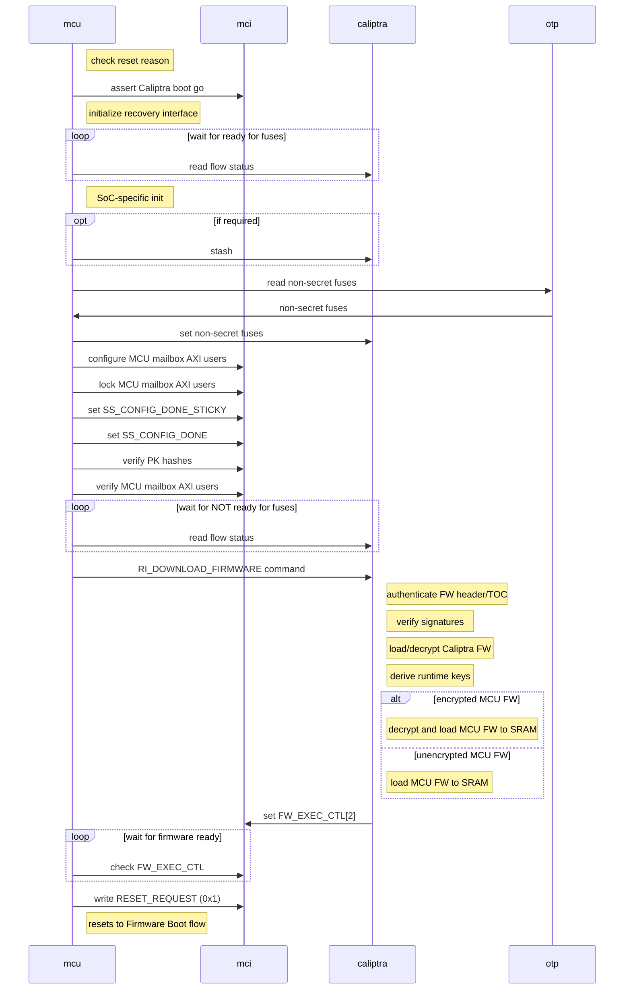
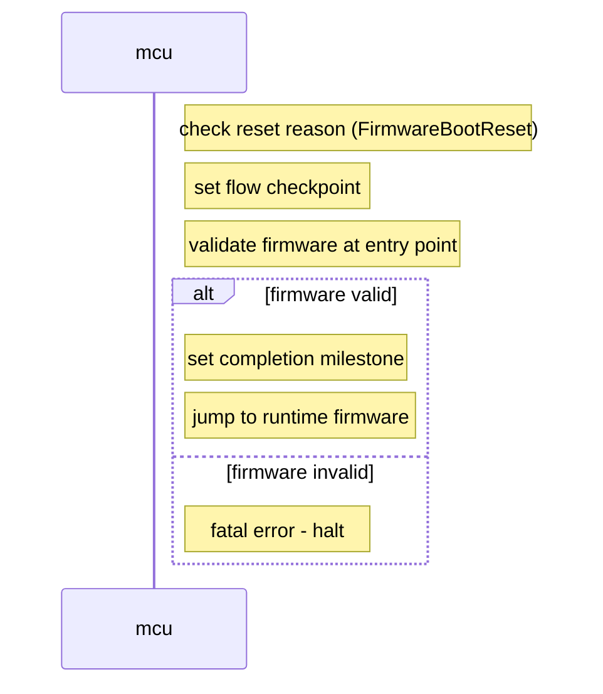
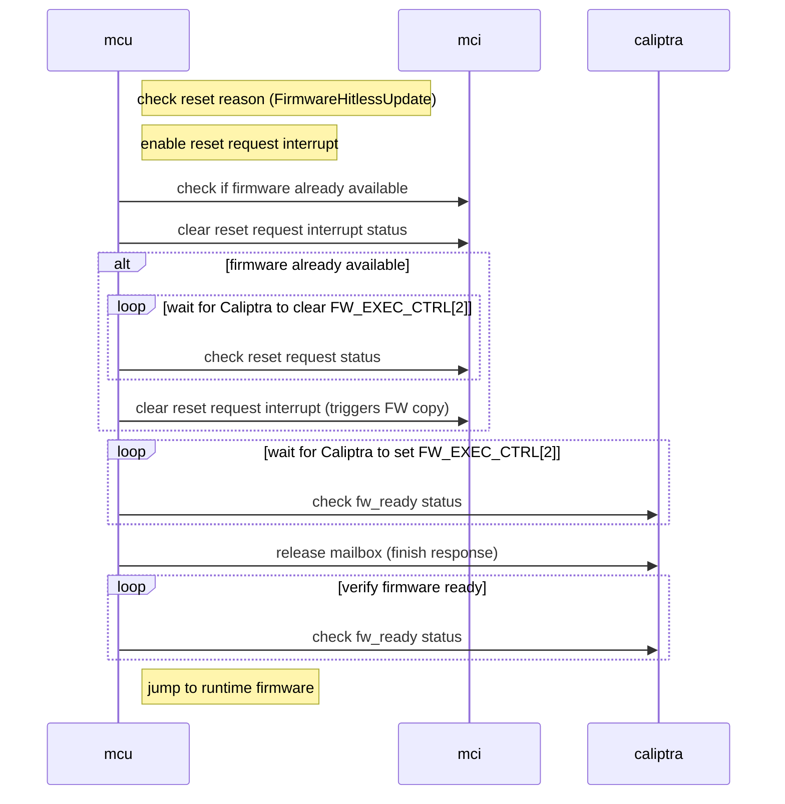
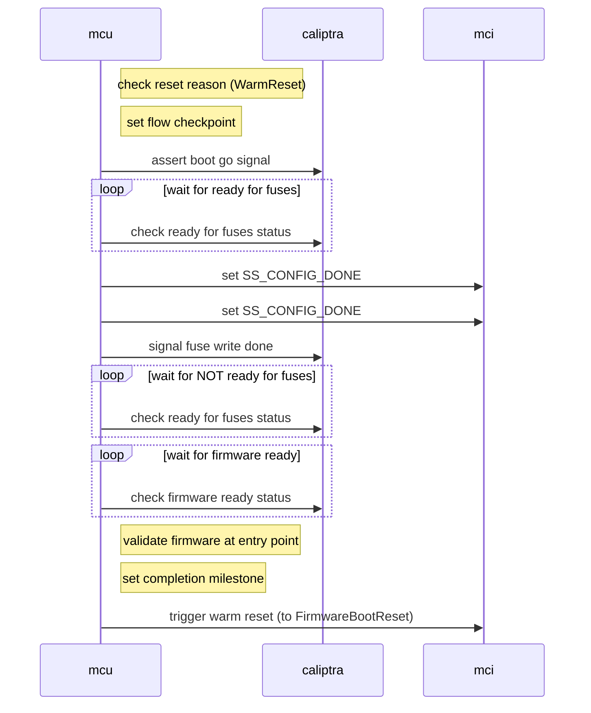

# Reference ROM Specification

The reference ROM is executed when the MCU starts.

The ROM's main responsibilities to the overall Caliptra subsystem are to:

* Send non-secret fuses to Caliptra core
* Initialize I3C and the firmware recovery interface
* Jump to firmware

It can also handle any other custom SoC-specific initialization that needs to happen early.

## Boot Flows

There are three main boot flows that needs to execute for its role in the Caliptra subsystem:

* Cold Boot Flow
* Firmware Update Flow
* Warm Reset Flow

These are selected based on the MCI `RESET_REASON` register that is set by hardware whenver the MCU is reset.

### Cold Boot Flow

1. Check the MCI `RESET_REASON` register for MCU status (it should be in cold boot mode)
1. Initialize I3C recovery interface. For AXI bypass boot, only the recovery interface initialization is required; basic I3C initialization can be skipped.
   * For I3C boot: Initialize I3C registers according to the [initialization sequence](https://chipsalliance.github.io/i3c-core/initialization.html), then initialize I3C recovery interface per the [recovery flow](https://chipsalliance.github.io/i3c-core/recovery_flow.html).
   * For AXI bypass boot: Only initialize the recovery interface registers needed for streaming boot.
1. Assert Caliptra boot go signal to bring Caliptra out of reset.
1. Read Caliptra SoC `FLOW_STATUS` register to wait for Caliptra Ready for Fuses state.
1. Anything SoC-specific can happen here
   1. Stash to Caliptra if required (i.e., if any security-sensitive code is loaded, such as PLL programming or configuration loading). Note: Caliptra must be up and ready for fuses before stashing can occur.
1. Read non-secret fuses from the OTP controller. The authoritative fuse map is contained in [the main Caliptra specification](https://github.com/chipsalliance/Caliptra/blob/main/doc/Caliptra.md#fuse-map).
1. Write fuse data to Caliptra SoC interface fuse registers. The following fuses are written to the corresponding Caliptra registers:
    * [`FUSE_PQC_KEY_TYPE`](https://chipsalliance.github.io/caliptra-rtl/main/internal-regs/?p=clp.soc_ifc_reg.fuse_pqc_key_type): Vendor PQC key type (2 bits)
    * [`FUSE_FMC_KEY_MANIFEST_SVN`](https://chipsalliance.github.io/caliptra-rtl/main/internal-regs/?p=clp.soc_ifc_reg.fuse_soc_manifest_svn%5B0%5D): FMC key manifest SVN (32 bits)
    * [`FUSE_VENDOR_PK_HASH`](https://chipsalliance.github.io/caliptra-rtl/main/internal-regs/?p=clp.soc_ifc_reg.fuse_vendor_pk_hash%5B0%5D): Vendor public key hash (384 bits)
    * [`FUSE_RUNTIME_SVN`](https://chipsalliance.github.io/caliptra-rtl/main/internal-regs/?p=clp.soc_ifc_reg.fuse_runtime_svn%5B0%5D): Runtime SVN (128 bits)
    * [`FUSE_SOC_MANIFEST_SVN`](https://chipsalliance.github.io/caliptra-rtl/main/internal-regs/?p=clp.soc_ifc_reg.fuse_soc_manifest_svn): SoC manifest SVN (128 bits)
    * [`FUSE_SOC_MANIFEST_MAX_SVN`](https://chipsalliance.github.io/caliptra-rtl/main/internal-regs/?p=clp.soc_ifc_reg.fuse_soc_manifest_max_svn): SoC manifest max SVN (32 bits)
    * [`FUSE_MANUF_DBG_UNLOCK_TOKEN`](https://chipsalliance.github.io/caliptra-rtl/main/internal-regs/?p=clp.soc_ifc_reg.fuse_manuf_dbg_unlock_token): Manufacturing debug unlock token (128 bits)
    * [`FUSE_ECC_REVOCATION`](https://chipsalliance.github.io/caliptra-rtl/main/internal-regs/?p=clp.soc_ifc_reg.fuse_ecc_revocation): Vendor ECC key revocation (4 bits)
    * [`FUSE_LMS_REVOCATION`](https://chipsalliance.github.io/caliptra-rtl/main/internal-regs/?p=clp.soc_ifc_reg.fuse_lms_revocation): Vendor LMS key revocation (32 bits)
    * [`FUSE_MLDSA_REVOCATION`](https://chipsalliance.github.io/caliptra-rtl/main/internal-regs/?p=clp.soc_ifc_reg.fuse_mldsa_revocation): Vendor MLDSA key revocation (4 bits)
    * [`CPTRA_OWNER_PK_HASH`](https://chipsalliance.github.io/caliptra-rtl/main/internal-regs/?p=clp.soc_ifc_reg.CPTRA_OWNER_PK_HASH): Owner public key hash (384 bits, written only if non-zero, could be overridden by [device ownership transfer](dot.md))
    * [`FUSE_SOC_STEPPING_ID`](https://chipsalliance.github.io/caliptra-rtl/main/internal-regs/?p=clp.soc_ifc_reg.fuse_soc_stepping_id): SoC stepping ID (16 bits)
    * [`FUSE_ANTI_ROLLBACK_DISABLE`](https://chipsalliance.github.io/caliptra-rtl/main/internal-regs/?p=clp.soc_ifc_reg.fuse_anti_rollback_disable): Anti-rollback disable (1 bit)
    * [`FUSE_IDEVID_CERT_ATTR`](https://chipsalliance.github.io/caliptra-rtl/main/internal-regs/?p=clp.soc_ifc_reg.fuse_idevid_cert_attr): IDevID certificate attributes (768 bits)
    * [`FUSE_IDEVID_MANUF_HSM_ID`](https://chipsalliance.github.io/caliptra-rtl/main/internal-regs/?p=clp.soc_ifc_reg.fuse_idevid_manuf_hsm_id): IDevID manufacturing HSM identifier (128 bits)
    * [`SS_UDS_SEED_BASE_ADDR_L/H`](https://chipsalliance.github.io/caliptra-rtl/main/internal-regs/?p=clp.soc_ifc_reg.SS_UDS_SEED_BASE_ADDR_L): UDS/FE partition base address in OTP
    * [`SS_STRAP_GENERIC`](https://chipsalliance.github.io/caliptra-rtl/main/internal-regs/?p=clp.soc_ifc_reg.SS_STRAP_GENERIC): OTP DAI idle bit offset and direct access command register offset
    * [MCI] [`PROD_DEBUG_UNLOCK_PK_HASH_REG`](https://chipsalliance.github.io/caliptra-ss/main/regs/?p=soc.mci_top.mci_reg.PROD_DEBUG_UNLOCK_PK_HASH_REG%5B0%5D%5B0%5D) Production debug unlock public key hashes (384 bytes total for 8 key hashes)
1. Configure MCU mailbox AXI users (see [Security Configuration](#security-configuration) below).
1. Set mailbox AXI user lock registers.
1. [2.1] Set [FC_FIPS_ZEROZATION](https://chipsalliance.github.io/caliptra-ss/main/regs/?p=soc.mci_top.mci_reg.FC_FIPS_ZEROZATION) to the appropriate value.
1. Set `SS_CONFIG_DONE_STICKY`, `SS_CONFIG_DONE` registers to lock MCI configuration.
1. Verify PK hashes and MCU mailbox AXI users after locking (see [Security Configuration](#security-configuration) below).
1. Poll on Caliptra `FLOW_STATUS` registers for Caliptra to deassert the Ready for Fuses state.
1. Handle [device ownership transfer](./dot.md), if applicable.
1. Stash the MCU ROM and other measurements to Caliptra.
1. Send the `RI_DOWNLOAD_FIRMWARE` command to Caliptra to start the firmware loading process. Caliptra will:
   1. Follow all of the [steps](https://github.com/chipsalliance/caliptra-sw/blob/main/rom/dev/README.md#firmware-processor-stage) in the Caliptra ROM documentation for firmware loading in the ROM cold reset.
   1. Transition to Caliptra runtime firmware.
   1. Load the SoC manifest over the recovery interface and verify it.
   1. Load the MCU runtime over the recovery interface registers to the MCU SRAM.
   1. Verify the MCU runtime against the SoC manifest.
   1. [2.1] If the MCU runtime is encrypted:
      1. Caliptra runtime returns to mailbox processing mode.
      1. MCU derives or imports the decryption key to the Caliptra cryptographic mailbox.
      1. MCU issues a CM_AES_GCM_DECRYPT_DMA command to decrypt the firmware in MCU SRAM.
      1. MCU issues the ACTIVATE_FIRMARE command to Caliptra activate the MCU firmware.
   1. Caliptra sets the MCI [`FW_EXEC_CTRL[2]`](https://chipsalliance.github.io/caliptra-rtl/main/internal-regs/?p=clp.soc_ifc_reg.SS_GENERIC_FW_EXEC_CTRL%5B0%5D) bit to indicate that MCU firmware is ready
1. Wait for Caliptra to indicate MCU firmware is ready by polling the firmware ready status.
1. MCU ROM triggers a reset by writing `0x1` to the MCI `RESET_REQUEST` register. This generates a hardware reset of the MCU core while maintaining power. The MCI hardware automatically sets `RESET_REASON` to `FirmwareBootReset`, causing the MCU to restart and enter the Firmware Boot Reset flow, which will jump to the loaded firmware.
1. Clear the watchdog timer.

### Firmware Boot Flow

This flow is used to boot the MCU into the MCU Runtime Firmware following either a cold or warm reset. It ensures that the runtime firmware is properly loaded and ready for execution.

1. Check the MCI `RESET_REASON` register for MCU status (it should be in firmware boot reset mode `FirmwareBootReset`)
1. Set flow checkpoint to indicate firmware boot flow has started
1. Validate that firmware was actually loaded by checking the firmware entry point is not zero
1. Set flow milestone to indicate firmware boot flow completion
1. Jump directly to runtime firmware at the configured SRAM offset

### Hitless Firmware Update Flow

Hitless Update Flow is triggered when MCU runtime FW requests an update of the MCU FW by sending the `ACTIVATE_FIRMWARE` mailbox command to Caliptra. Upon receiving the mailbox command, Caliptra will initialize the MCU reset sequence causing the MCU to boot to ROM and run the Hitless Firmware Update Flow.

1. Check the MCI `RESET_REASON` register for reset status (it should be in hitless firmware update mode `FirmwareHitlessUpdate`).
1. Enable the `notif_cptra_mcu_reset_req_sts` interrupt.
1. Check if firmware is already available by reading the interrupt status
1. Clear `notif_cptra_mcu_reset_req_sts` interrupt status
1. If firmware is available:
    1. Wait for Caliptra to clear FW_EXEC_CTRL[2]. This will be indicated when `notif_cptra_mcu_reset_req_sts` interrupt status bit is set
    1. Clear the `notif_cptra_mcu_reset_req_sts` interrupt. This triggers Caliptra to copy MCU FW from the staging area to MCU SRAM.
1. Wait for Caliptra to set FW_EXEC_CTRL[2].
1. Release Caliptra mailbox. Hitless Update is triggered by a mailbox command from MCU to Caliptra which causes it to reboot to ROM, therefore the mailbox needs to be released after the update is complete.
1. Jump to runtime firmware at the configured SRAM offset

### Warm Reset Flow

Warm Reset Flow occurs when the subsystem reset is toggled while `powergood` is maintained high. This is allowed when MCU and Caliptra already loaded their respective mutable firmware, prior to the warm reset. MCU and Caliptra FW will not be reloaded in this flow.

1. Check the MCI `RESET_REASON` register for reset status (it should be in warm reset mode `WarmReset`)
1. Assert Caliptra boot go signal to bring Caliptra out of reset.
1. Wait for Caliptra to be ready for fuses (even though fuses won't be rewritten)
1. Set `SS_CONFIG_DONE` register to lock MCI configuration until next warm reset.
1. Signal fuse write done to Caliptra to complete the fuse handshake protocol
1. Wait for Caliptra to deassert ready for fuses state
1. Wait for Caliptra to indicate that MCU firmware is ready in SRAM
1. Validate that firmware was actually loaded by checking the firmware entry point is not zero
1. Set flow checkpoint and milestone to indicate warm reset flow completion
1. Trigger a warm reset to transition to `FirmwareBootReset` flow which will jump to the firmware

### Failures

On any fatal or non-fatal failure, MCU ROM can use the MCI registers `FW_ERROR_FATAL` and `FW_ERROR_NON_FATAL` to assert the appropriate errors.

In addition, SoC-specific failure handling may occur.

There will also be a watchdog timer running to ensure that the MCU is reset if not the ROM flow is not progressing properly.

## Security Configuration

The MCU ROM is responsible for configuring and locking security-sensitive MCI registers during the boot process. This section describes the security requirements and verification steps that must be performed.

### Configuration Locking

The MCI provides two configuration lock registers:

* **`SS_CONFIG_DONE_STICKY`**: Locks configuration registers until the next cold reset. This is set during cold boot after all sticky configuration is complete.
* **`SS_CONFIG_DONE`**: Locks configuration registers until the next warm reset. This is set during both cold boot and warm boot flows.

These registers must be set after configuring security-sensitive registers and before signaling fuse write done to Caliptra.

**Security Requirement**: After setting these registers, MCU ROM must verify that they are actually set by reading them back. If either register fails to set, the ROM must trigger a fatal error (`ROM_SOC_SS_CONFIG_DONE_VERIFY_FAILED`) and halt. This ensures that the locking mechanism itself has not been tampered with.

### Production Debug Unlock PK Hash Verification

The `PROD_DEBUG_UNLOCK_PK_HASH_REG` registers in MCI store the public key hashes used for production debug unlock authentication. These registers are writable by the MCU but have no access protections before `SS_CONFIG_DONE_STICKY` is set. This creates a window where another AXI user could potentially manipulate the PK hashes between configuration and locking.

**Security Requirement**: MCU ROM must verify that the PK hash values written to MCI match the expected values from the fuse controller after both `SS_CONFIG_DONE_STICKY` and `SS_CONFIG_DONE` are set. If verification fails, the ROM must trigger a fatal error and halt.

The verification process:
1. MCU ROM writes PK hash values from fuses to `PROD_DEBUG_UNLOCK_PK_HASH_REG` registers
1. [2.1] MCU ROM writes the [FC_FIPS_ZEROZATION](https://chipsalliance.github.io/caliptra-ss/main/regs/?p=soc.mci_top.mci_reg.FC_FIPS_ZEROZATION) register
1. MCU ROM sets `SS_CONFIG_DONE_STICKY` and `SS_CONFIG_DONE` to lock the registers
1. MCU ROM reads back the PK hash register values and compares them against the original fuse values
1. [2.1] MCU ROM reads back the FC_FIPS_ZEROIZATION register and verifies its value.
1. If any mismatch is detected, MCU ROM reports a fatal error (`ROM_SOC_PK_HASH_VERIFY_FAILED`)

### MCU Mailbox AXI User Verification

The `MBOX0_VALID_AXI_USER` and `MBOX1_VALID_AXI_USER` registers control which AXI users can access the MCU mailboxes. These registers are locked using `MBOX0_AXI_USER_LOCK` and `MBOX1_AXI_USER_LOCK`, which make the corresponding AXI user registers read-only. Note that unlike the PK hash registers, the MBOX registers are not affected by `SS_CONFIG_DONE*`—only the LOCK registers control their access.

**Security Requirement**: MCU ROM must configure the MCU mailbox AXI users, lock them using the LOCK registers, and verify that both the AXI user values and the lock register values match the expected configuration. If verification fails, the ROM must trigger a fatal error and halt. The verification is performed after `SS_CONFIG_DONE_STICKY` and `SS_CONFIG_DONE` are set to consolidate all MCI register verification in one place.

The verification process:
1. MCU ROM configures `MBOX[0,1]_VALID_AXI_USER` registers with the expected AXI user values
2. MCU ROM sets `MBOX[0,1]_AXI_USER_LOCK` to lock each configured slot (this makes the AXI user registers read-only)
3. MCU ROM sets `SS_CONFIG_DONE_STICKY` and `SS_CONFIG_DONE`
4. MCU ROM verifies that both config done registers are actually set
5. MCU ROM reads back the `MBOX[0,1]_VALID_AXI_USER` register values and compares them against the expected configuration
6. MCU ROM reads back the `MBOX[0,1]_AXI_USER_LOCK` register values and verifies they match the expected lock status
7. If any mismatch is detected in either the AXI user values or lock status, MCU ROM reports a fatal error (`ROM_SOC_MCU_MBOX_AXI_USER_VERIFY_FAILED`)

### Warm Reset Considerations

On warm reset, `SS_CONFIG_DONE_STICKY` remains set from the cold boot, so sticky registers are already locked and do not need to be reconfigured or verified. However, `SS_CONFIG_DONE` is cleared on warm reset, so:

* MCU ROM must set `SS_CONFIG_DONE` after configuring any non-sticky registers
* MCU ROM must verify that `SS_CONFIG_DONE` is actually set
* Verification of sticky registers (PK hashes, MCU mailbox AXI users) is not required on warm reset since they are already locked